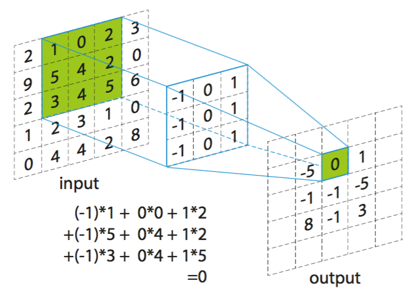

CNN
====
CNN(Convolutional Neural Network) is absolutely good, but here we will only discuss the disadvantages of CNN and how to improve

#### Coupling
 
Coupling exists between adjacent elements of the output matrix, pooling layer can remove coupling to a certain degree

Reference
----
* [Understanding and Improving Convolutional Neural Networks via Concatenated Rectified Linear Units](https://arxiv.org/abs/1603.05201)
