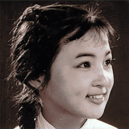

Colorizing Black And White Photos - A Funny Example For Deep Learning Beginners
====
In this example, you will learn how to use artificial neural network for colorizing black and white photos

We designed two models: 
**Model A**
  
**Model B**
  

Input is black and white photo, output is colorized photo

For a quicker test, Model B use tiny images of size 64×64 
There are 179 train samples in total, no transfer learning, no data augmentation

Following is the result for Model A:
<table>
<tr><th>input</th><th>output</th></tr>	
<tr><td></td>
<td></td></tr>
<tr><td></td>
<td></td></tr>
<tr><td></td>
<td></td></tr>
<tr><td></td>
<td></td></tr>
</table>

Following is the result for Model B:
<table>
<tr><th>input</th><th>output</th></tr>	
<tr><td></td>
<td></td></tr>
<tr><td></td>
<td></td></tr>
<tr><td></td>
<td></td></tr>
<tr><td></td>
<td></td></tr>
<tr><td></td>
<td></td></tr>
<tr><td></td>
<td></td></tr>
</table>

Reference
----
* https://github.com/emilwallner/Coloring-greyscale-images-in-Keras
* https://github.com/richzhang/colorization/tree/master/colorization
* https://github.com/phillipi/pix2pix

[Github Link](https://github.com/microic/niy/tree/master/examples/colorizing_photos)